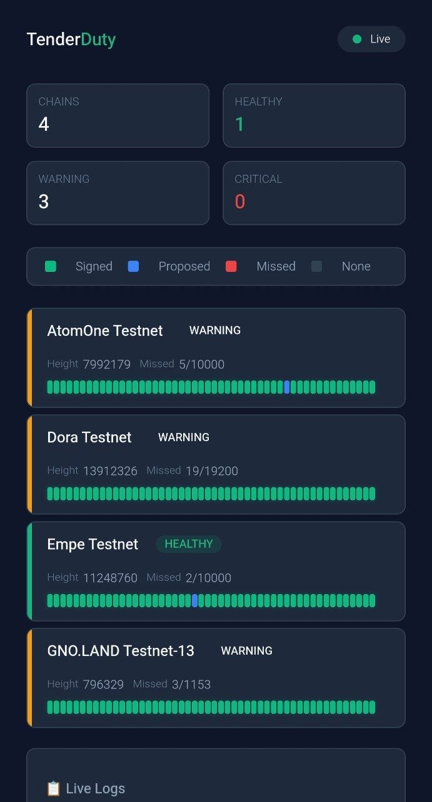

# RoomDuty (TenderDuty Fork)
A multi-chain validator dashboard.

## Features
- Multi-chain monitoring: AtomOne, Gno.land, Tendermint/Cosmos
- Blockchain-kind flag based signing parser
- Row-based responsive layout



## Config

Add `blockchain_kind` to each chain in `config.yml`:

```yaml
chains:
  "AtomOne Testnet":
    chain_id: atomone-testnet-1
    blockchain_kind: atomone
    valoper_address: "atonevaloper10szh6uwqx8qy0lsp3fpkvnj99tsf2nf4g9uazc"
    nodes:
      - url: http://10.35.4.199:16711
        alert_if_down: yes

  "GNO.LAND Testnet-13":
    chain_id: test-13
    blockchain_kind: gnoland
    chain_type: gno
    gno_valopers_realm: gno.land/r/gnops/valopers
    valoper_address: g1zyk4gkw68lzx9yfgcda2ur36yy6dfdtyzglvsc
    nodes:
      - url: http://10.35.4.196:26657
        alert_if_down: yes

  "Empe Testnet":
    chain_id: empe-testnet-2
    blockchain_kind: tendermint
    valoper_address: empevaloper17nzylr32ldznyah54ffst2asa3qkgrmgap4j6t
    nodes:
      - url: http://10.35.4.197:16710
        alert_if_down: yes
```

### Supported blockchain_kind values
- `tendermint` — Tendermint/Cosmos SDK chains (default)
- `atomone` — AtomOne chain (custom signing parser)
- `gnoland` — Gno.land chain (custom signing parser; also set `chain_type: gno`)
